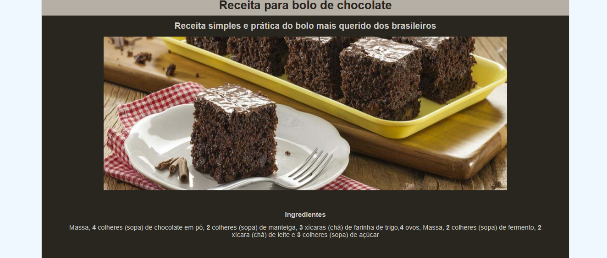

# Projeto-Iniciante-Front-06
O Projeto aqui é do nível Iniciante, utilizando HTML/CSS

 
    
    

#

#06 Receita de Bolo

O projeto simula uma receita de bolo, o projeto foi desenvolvido por mim <b>mesmo</b>. Nele foi utilizado algumas tags como:

<b>HTML</b>

- div
- ol
- img

<b>CSS</b>

- display : Flex
- efeitos houver
- classes nos estilos

#

    

